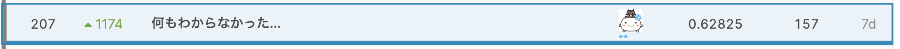

# kaggle_m5_forecasting

My 207th🥈solution for Kaggle M5 Forecasting Competition (https://www.kaggle.com/c/m5-forecasting-accuracy/overview)

The detail of the solution: https://github.com/kiccho1101/paper/blob/master/Kaggle/M5.md



## Features

- Rolling mean, std
- Rolling grouped mean, std
- Shift
- Discount rate
- Event strength
- catch22 features
- Target encoding features
- etc...

## PB LeaderBoard History

2020-04-02 0.64561 (first submission)

2020-04-04 0.63581

2020-04-04 0.55002 (thanks to dark magic https://www.kaggle.com/kyakovlev/m5-dark-magic)

2020-04-05 0.53538

2020-04-10 0.51792

2020-04-11 0.50514

2020-04-11 0.48833 (thanks to iterative prediction https://www.kaggle.com/kneroma/m5-first-public-notebook-under-0-50)

2020-04-12 0.48273

2020-04-23 0.47101

2020-04-24 0.46930

## Ponchi


## Step1. Set up environments with pipenv

```bash
pipenv install --dev --skip-lock
sh install_lightgbm_2.3.2.sh
```

## Step2. Download data

Unzip it and put the csv files in ./kaggle_m5_forecasting/ directory.

## Step3. Start up luigi / mlflow server (in other terminal windows)

```bash
luigid  # localhost:8082
```

```bash
mlflow ui  # localhost:5000
```

## Step4. Run the cross validation

```bash
pipenv run python main.py m5.LGBMCrossValidation
```
